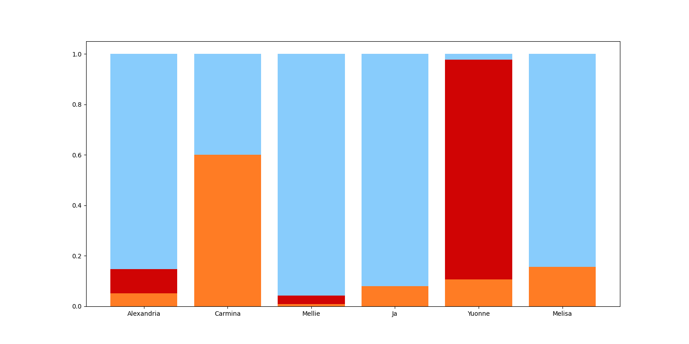

# Secret Hitler Prediction
Command-line app to predict players' roles in the social deduction game "Secret Hitler."

The app can be run using
```sh
python manage.py [-h] <subcommand> ...
```

## Subcommands
### import
```sh
python manage.py import [-h] [--file FILE]
```
Imports gameplay data from a spreadsheet. The spreadsheet filename can be specified using the `--file` argument and defaults to "data/example.xlsx."

### predict
```sh
python manage.py predict [-h] [--game GAME] [--round ROUND]
```
Predicts player roles. The game ID can be provided using the `--game` argument and the round can be specified using the `--round` argument. If no game is provided, the app will default to the game with the highest ID. If no round is provided and the game is complete, the second-last round will be used. If no round is provided and the game is not complete, the last round will be used.

### stats
```sh
python manage.py stats [-h] table
```
Displays statistics. The `table` argument selects the data to display. Valid choices are:
- `player-win-rates`
- `team-win-rates`
- `p-values`

## Example
A set of example games is available in "data/example.xlsx." An example output is also available in "data/example.png." It was generated from game 48, on which the algorithm performed particularly well. In that game, "Yuonne" was Hitler and "Carmina" was Fascist.

